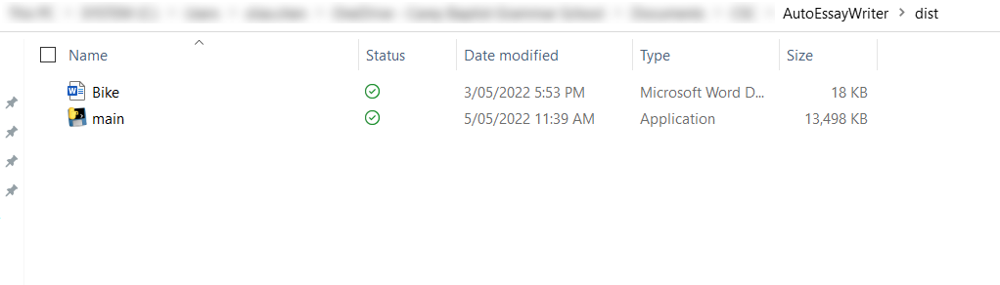
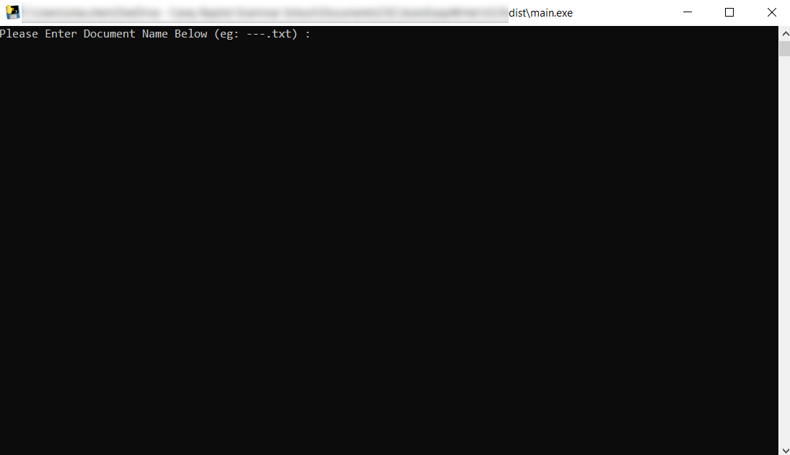
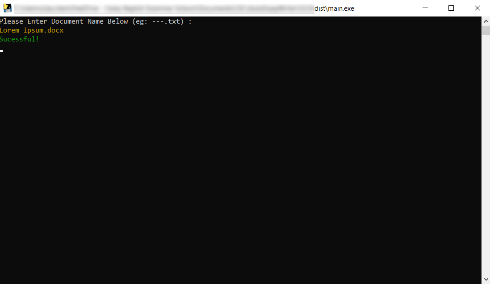

# AutoEssayWriter 1.0

For all the lazy people out there, or people wanting to get full marks, this is the software for you!

By using this softwarer, it can autotype your pre-written essay that operates no different from a real person.

## How-To-Use

Move your word document into the (dist) folder

Run main in dist and enter the name of document

Switch to a blank word document after the "Program will start in 5 sec"

**Now it will run!**

To pause just hold down esc until stop

To unpause just press esc

To stop just close program

## Acknowledgements

- Tiffany (Scholar) for giving the idea
- Moses for wanting to use the program
- Creater: Silas
